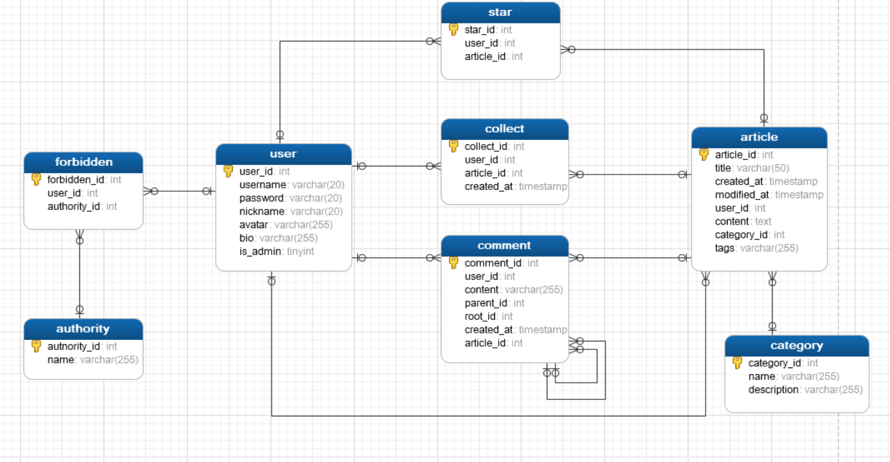

# geeklog
Geek's blog!

## Restful API
等待设计

## 项目需求
- 1.用户
    - 1.1.登录
       - 用户名唯一
       - 密码加密存储（MD5或其他）
    - 1.2.编辑文章、发布申请
       - 文章至少包括：标题、时间、作者、内容、纯文本编辑、发布申请按钮、文章分类（管理员指定，作者选择）、文章标签（用户自定义）、浏览次数、
    - 1.3.查看、编辑个人资料页面
       - 个人页面至少包括：用户名（不可重复）、昵称（可重复）、头像、
简介、修改密码、
    - 1.4.浏览他人发布文章、评论
       - 浏览文章后，可以评论
    - 1.5.点赞、收藏文章
- 2.管理员
  - 2.1.删除不良文章或评论
  - 2.2.编辑文章分类类别
       - 如果分类非空，不能删除分类
       - 可以修改分类名称
       - 增加分类
  - 2.3.冻结用户
    
- 3.游客
    - 3.1.浏览他人文章、评论、
    - 3.2.注册
       - 填写个人资料里涉及的相关信息及密码。
- 4.功能
    - 4.1.文章分类
       - 分类不可自定义，应该由管理员指定。

## 数据库

## 分工
- 前端组：佘玉非（负责人）、何志颖、
- 后端组：潘浩然（负责人）、朱远飞、午康俊、吴绍杰（少量）
- 文档：吴绍杰（大量）、午康俊（少量）、佘玉非（少量）、何志颖（少量）、潘浩然（少量）、朱远飞（少量）、
- 任务分配：全组讨论、
- 任务督促及跟踪：何志颖
- 定期组织开会：何志颖

## 技术路线
- 前后端分离，前后端通讯采用restful API结合Ajax。
- 前端：react
- 后端：java SSM(Spring boot)
- Ajax: axios
- 用户认证：json web token(JWT)
- 数据库：MySQL
- 服务器：undertow
- 部署：docker和docker-compose
- 前端测试：postman、restful client(vscode)
- 后端测试：spock、junit
- 工程化工具：git、github、webpack、maven等

## 总体设计

### 前端（佘玉非）
#### 创建UI流程
1. 根据UI设计图划分组件并画出组件层次图
   - 用方框划分出每一个组件(和子组件)并给他们命名
   - Photoshop 图层名称也许就是你的 React 组件名称
   - 单一功能原则,一个组件应该只做一件事情
   - UI和数据模型(json)往往遵循着相同的信息架构
2. 创建静态UI
   - 传入数据模型，渲染 UI 但没有任何交互
   - 创建一个静态版本更多需要的是码代码，不太需要逻辑思考，而添加交互则更多需要的是逻辑思考，不是码代码
   - 通过 props 来传递数据,不要使用 state
   - 在较为简单的例子中，通常自顶向下更容易，而在较大的项目中，自底向上会更容易并且在你构建的时候有利于编写测试。
   - 这些组件只会有 render() 方法，因为这只是你的应用的静态版本。
3. 识别state最小完整表示
   - 要点是 DRY：不要重复(Don’t Repeat Yourself)
   - 它是通过 props 从父级传来的吗？如果是，他可能不是 state.
   - 它随着时间推移不变吗？如果是，它可能不是 state
   - 你能够根据组件中任何其他的 state 或 props 把它计算出来吗？如果是，它不是 state。
4. 确认state位置
   对你应用的每一个 state：
  - 确定每一个需要这个 state 来渲染的组件。
  - 找到一个公共所有者组件(一个在层级上高于所有其他需要这个 state 的组件的组件)
  - 这个公共所有者组件或另一个层级更高的组件应该拥有这个 state。
  - 如果你没有找到可以拥有这个 state 的组件，创建一个仅用来保存状态的组件并把它加入比这个公共所有者组件层级更高的地方。
5. 添加反向数据流
   - 层级结构中最底层的表单组件需要去更新在上层中的state
   - 因为组件应该只更新自己的状态， **上层包含state的组件**会将一个回调函数传递给**底层的表单组件**,每当应该更新状态时，它就会触发。
   - 我们可以使用**底层的表单组件**上的 onChange 事件来调用它。
   - **上层包含state的组件**传入的回调函数会调用 setState()，这时应用程序会被更新。
   - React 的数据流很明显，让你可以很轻松的了解你的程序是如何运行的，但相较于传统的双向绑定，它的代码量会稍微多一点。

### 后端（潘浩然）

## 详细设计

### 前端（佘玉非）

### 后端（潘浩然）

## 编码

## 测试

## 部署

