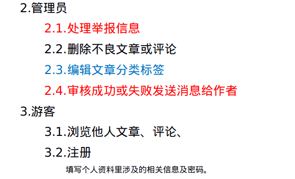

# geeklog
Geek's blog!

## 会议历史
- 9月6日 21:40 自习室
  - 内容：数据库设计、API设计、（以最终需求设计）
  - 何志颖：主持会议流程
  - 潘浩然：记录数据库设计（实体、属性、关系）
  - 佘玉非：记录API接口（json格式接口)
  - 午康俊：会议记录（会议过程中的细节和重要信息）
  - 朱远飞：审核设计（数据库和API设计好后，二次检查是否合理）
  - 会议结束后，每个人把自己记录的文件发给何志颖

## Restful API
等待设计

## 第一阶段需求
### !!!数据库设计和API设计参考总项目需求!!!

## 总项目需求

## 技术路线
- 前后端分离，前后端通讯采用restful API结合Ajax。
- 前端：react
- 后端：java SSM(Spring boot)
- Ajax: axios
- 用户认证：json web token(JWT)
- 数据库：MySQL
- 服务器：undertow
- 部署：docker和docker-compose
- 前端测试：postman、restful client(vscode)
- 后端测试：spock、junit
- 工程化工具：git、github、webpack、maven等

## 分工
- 前端组：佘玉非（负责人）、何志颖、
- 后端组：潘浩然（负责人）、朱远飞、午康俊（少量）、
- 文档：午康俊（大量）、佘玉非（少量）、何志颖（少量）、潘浩然（少量）、朱远飞（少量）、
- 任务分配：全组讨论、
- 任务督促及跟踪：何志颖
- 定期组织开会：何志颖

## 总体设计

### 前端（佘玉非）

### 后端（潘浩然）

## 详细设计

### 前端（佘玉非）

### 后端（潘浩然）

## 编码

## 测试

## 部署

